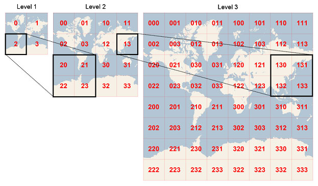

# 基础属性和方法

::: tip 前言
OpenLayers 是一个用于开发 WebGIS 客户端的 JavaScript 包，其设计之意是为互联网客户端提供强大的地图展示功能，包括地图数据显示与相关操作，并具有灵活的扩展机制
:::

  <Container url="https://zhoubichuan.com/resume/demo/?type=openlayers&name=1-1-0-0.vue" />

::: details 查看代码详情

<<< components/demo/1-1-0-0.vue

:::

<xminder />

## 1.Map

地图容器对象，通过 target 参数关联到 div 容器

## 2.View

View 是一个地图组件，在初始化 Map 的时候需要指定一个 View，创建 View 对象的时候，在构造函数中可以传递一个对象，用于指定地图的相关信息：

- 缩放等级
- 中心点
- 投影坐标

  <Container url="https://zhoubichuan.com/resume/demo/?type=openlayers&name=1-1-0-2.vue" />

::: details 查看代码详情

<<< components/demo/1-1-0-2.vue

:::

## 3.Layer

- Tile 类为瓦片抽象基类，其子类作为各类瓦片数据的数据源

  

从渲染角度来看，openlayers 的图层主要分为两类：Vector（矢量）和 Raster（栅格），矢量图层是指在渲染发生在浏览器的图层，source 返回的数据类型是矢量，如 geojson 的坐标串；栅格图层则是由服务器渲染，返回到浏览器的是一张张的瓦片图片，栅格图层主要用来展示。

- Vector 类为矢量数据源基类，为矢量图层提供具体的数据来源，包括直接组织或读取的矢量数据（Features）、远程数据源的矢量数据（即通过 url 设置数据源路径）等。若是 url 设置的矢量数据源，则通过解析器 Format（即 ol.format.Feature 的子类）来解析各类矢量数据，如 XML、Text、JSON、GML、KML、GPS、WFS、WKT、GeoJSON 等地图数据
- Image 类为单一图像基类，其子类为画布（canvas）元素、服务器图片、单个静态图片、WMS 单一图像等的数据源。它与 Tile 类的区别在于，Image 类对应的是一整张大图片，而不像瓦片那样很多张小图片，从而无需切片，也可以加载一些地图，适用于一些小场景地图

## 4.Controls

- 控件是一个地图上可见的小部件，其 DOM 元素位于屏幕上的固定位置。它们可以包含用户输入（以按钮的形式），也可以只提供信息。控件的位置是使用 CSS 来确定，当然也可以使用 CSS 来调整。默认情况下，控件被放置在地图控件层，也就是 CSS 类名为 ol-overlayContainer-stopEvent 的元素中，但也可以调整，使控件基于外部 DOM 元素来实现

## 5.Overlays

区别于 vector 这样的图层，Overlay 是浮动层的概念

- 弹窗
- 撒点
- gif 图片

## 6.Interactions

它和控件是一样的作用，用来控制地图的。区别是控件触发都是一些**可见**的 HTML 元素触发，如按钮、链接等；交互功能都是一些设备行为触发，都是不可见的，如：

- 鼠标双击
- 滚轮滑动
- 手机设备的手指缩放

## 7.坐标系

地理坐标系是三维的，我们要在地图或者屏幕上显示就需要转化为二维，这被称为 投影（Map projection）

从三维到二维的转化，必然会导致变形和失真，失真是不可避免的，但是不同投影下会有不同的失真，这让我们可以有得选择

常用的投影有 等矩矩形投影（Platte Carre） 和 墨卡托投影（Mercator）

左图表示地球球面上大小相同的圆形，右上为墨卡托投影，投影后仍然是圆形，但是在高纬度时物体被严重放大了。右下为等距投影，物体的大小变化不是那么明显，但是图像被拉长了。Platte Carre 投影因为在投影上有扭曲，并不适合于航海等活动，但是因为坐标与像素之间的对应关系十分简单，非常适合于栅格图的展示，Platte Carre 投影是很多 GIS 软件的默认投影。

对于 Web Map 开发人员来说，最熟悉的应该是 EPSG:4326 (WGS84) 和 EPSG:3857(Pseudo-Mercator)

EPSG:4326 (WGS84)
前面说了 WGS84 是目前最流行的地理坐标系统。在国际上，每个坐标系统都会被分配一个 EPSG 代码，EPSG:4326 就是 WGS84 的代码。GPS 是基于 WGS84 的，所以通常我们得到的坐标数据都是 WGS84 的。一般我们在存储数据时，仍然按 WGS84 存储。

EPSG:3857 (Pseudo-Mercator)
伪墨卡托投影，也被称为球体墨卡托，Web Mercator。它是基于墨卡托投影的，把 WGS84 坐标系投影到正方形。我们前面已经知道 WGS84 是基于椭球体的，但是伪墨卡托投影把坐标投影到球体上，这导致两极的失真变大，但是却更容易计算。这也许是为什么被称为”伪“墨卡托吧。另外，伪墨卡托投影还切掉了南北 85.051129° 纬度以上的地区，以保证整个投影是正方形的。因为墨卡托投影等正形性的特点，在不同层级的图层上物体的形状保持不变，一个正方形可以不断被划分为更多更小的正方形以显示更清晰的细节。很明显，伪墨卡托坐标系是非常显示数据，但是不适合存储数据的，通常我们使用 WGS84 存储数据，使用伪墨卡托显示数据。

- openlayers 中获取图层点位坐标方法为

```js
curFeature.getGeometry().getCoordinates(); //此方法返回一个数组，x轴与y轴坐标。
```

常用坐标系为 WGS84，全称 World Geodetic System 1984，是为 GPS 全球定位系统使用而建立的坐标系统。

- 投影 projection 有 2 种：

  <Container url="https://zhoubichuan.com/resume/demo/?type=openlayers&name=1-1-0-3.vue" />

::: details 查看代码详情

<<< components/demo/1-1-0-3.vue

:::

- 地图坐标转化

坐标转换，它的第一个参数是 ol.Coordinate 类型的坐标，后面两个参数依次是当前坐标所用的坐标系，及转换后的坐标所用的坐标系，ol.proj.transform([104.06, 30.67], 'EPSG:4326', 'EPSG:3857')就能把 EPSG:4326 的坐标[104.06, 30.67]转换为 EPSG:3857 的坐标。

```js
//第一个参数为坐标经纬度 第二个参数为被转化的坐标系  第三个参数为需要被转化为的坐标系
ol.proj.transform([104.06, 30.67], "EPSG:4326", "EPSG:3857");
ol.proj.transform(
  [12964910.690853572, 4884172.646815963],
  "EPSG:3857",
  "EPSG:4326"
);
```

<script>
window.onload = function() {
  alert(1)
};
</script>
